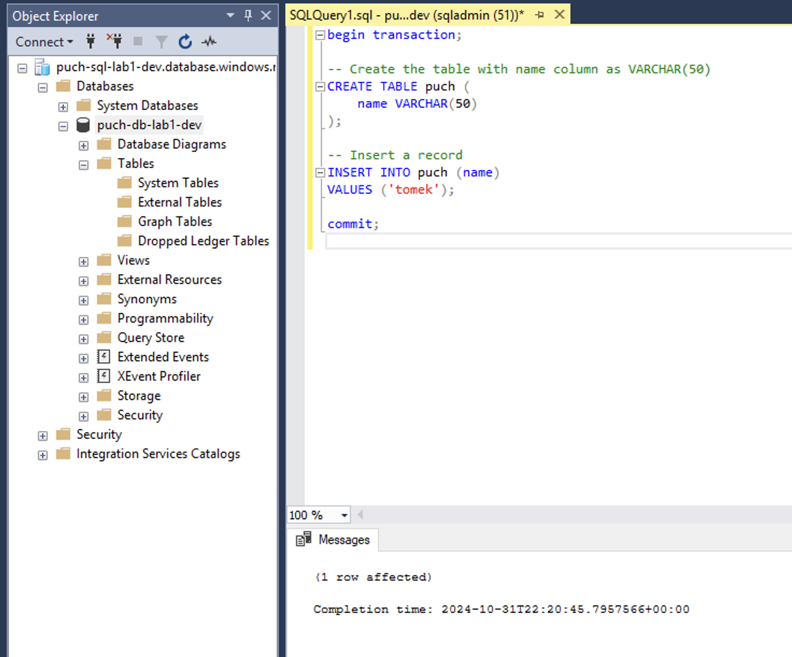
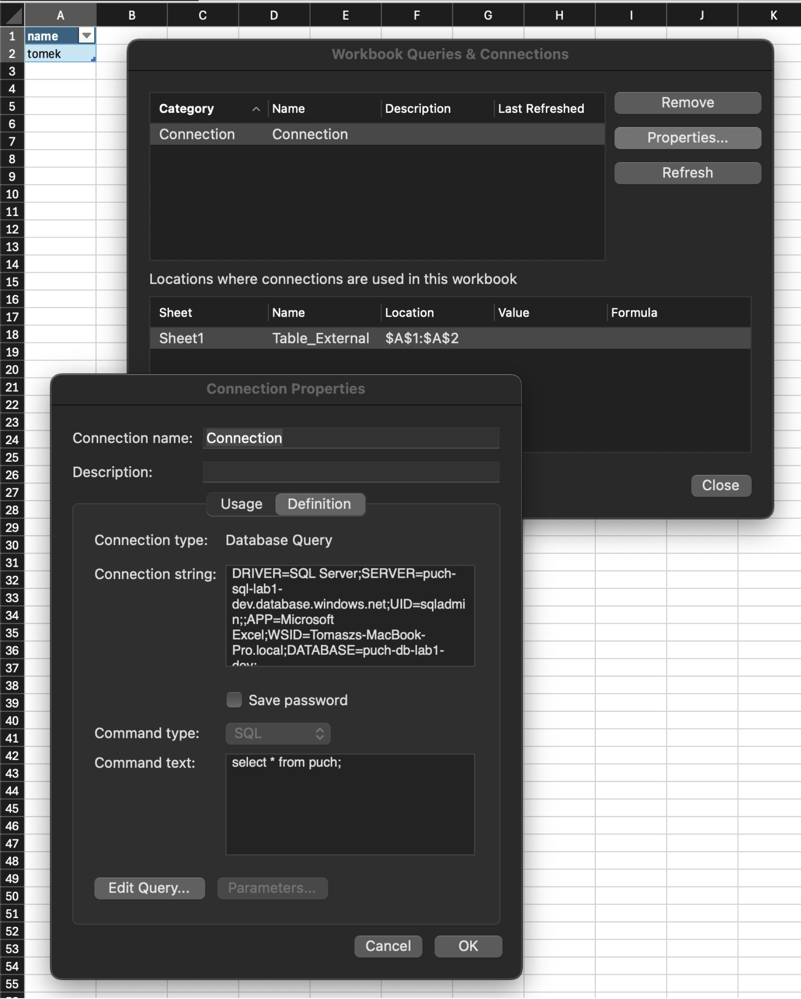

# Ćwiczenie: Baza danych MS SQL Server w Azure

## tworzenie konta w Azure

Konto w Azure utworzyłem już kilka semestrów temu także po prostu się do niego zalogowałem. Nie było w nim żadnych zasobów.

## Utworzenie instancji Azure SQL Database

Utworzyłem bazę danych. Użyłem bardzo skromnych rozmiarów sprzętu aby uniknąć niepotrzebnych kosztów.
Z tego samego powodu darowałem sobie replikację i backup.

## Połączenie z bazą danych

## Tworzenie aplikacji

Użyłem Microsoft Excel aby podłączyć się do bazy i zaimplementować wyświetlanie danych w interfejsie użytkownika.

