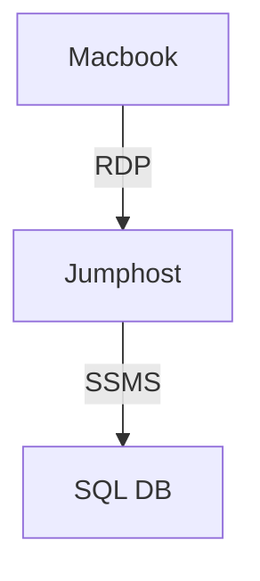

# Ćwiczenie: Baza danych MS SQL Server w Azure

## Utworzenie konta w Azure

Konto w Azure utworzyłem już kilka semestrów temu także po prostu się do niego zalogowałem (w panelu oraz używając narzędzia CLI `az`). Nie było w nim żadnych zasobów.

## Utworzenie instancji Azure SQL Database

Utworzyłem bazę danych. Użyłem bardzo skromnych rozmiarów sprzętu aby uniknąć niepotrzebnych kosztów.
Z tego samego powodu darowałem sobie replikację i backup.

## Połączenie z bazą danych

Zadanie realizowałem na swoim komputerze Macbook, zatem nie miałem dostępu do SSMS.
Aby móc wykorzystać SSMS stworzyłem VM w Azure z tym programem. Poniższy zrzut ekranu przedstawia połączenie z tego VM do mojej bazy.
VM została zabezpieczona przy użyciu reguły pozwalającej na przychodzący ruch sieciowy wyłącznie z mojego publicznego adresu IPv4.

Całe połączenie wyglądało zatem tak:



## Tworzenie aplikacji

Użyłem Microsoft Excel aby podłączyć się do bazy i zaimplementować wyświetlanie danych w interfejsie użytkownika.
Do **firewall**a bazy danych dodałem regułę pozwalającą na przychodzący ruch z mojego publicznego adresu IPv4.


## Praca z Azure Table Storage

Utworzyłem storage account, w nim tabelę, a w tabeli encję. Próbowałem napisać PowerQuery w Excelu aby połączyć się z tabelą, ale niestety nie udało mi się tego zrobić.

### CRUD

Napisałem [program w Pythonie](client/main.py), który dodaje, odczytuje, modyfikuje i usuwa encje z tabeli.

```text
$ python client/main.py 
client/main.py:27: DeprecationWarning: datetime.datetime.utcnow() is deprecated and scheduled for removal in a future version. Use timezone-aware objects to represent datetimes in UTC: datetime.datetime.now(datetime.UTC).
  "Timestamp": datetime.utcnow(),
Entity created successfully: employees/emp001
Entity found: {'PartitionKey': 'employees', 'RowKey': 'emp001', 'name': 'John Doe', 'email': 'john@example.com', 'department': 'IT'}
Entity updated successfully: employees/emp001

Listing all entities in partition 'employees':
{'PartitionKey': 'employees', 'RowKey': 'emp001', 'department': 'HR', 'email': 'john@example.com', 'name': 'John Doe', 'title': 'Manager'}
Entity deleted successfully: employees/emp001

Listing all entities in partition 'employees':

Process finished with exit code 0
```

## Azure Cosmos DB