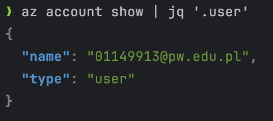
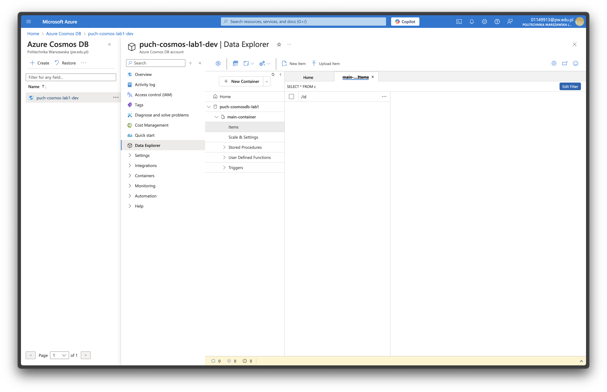
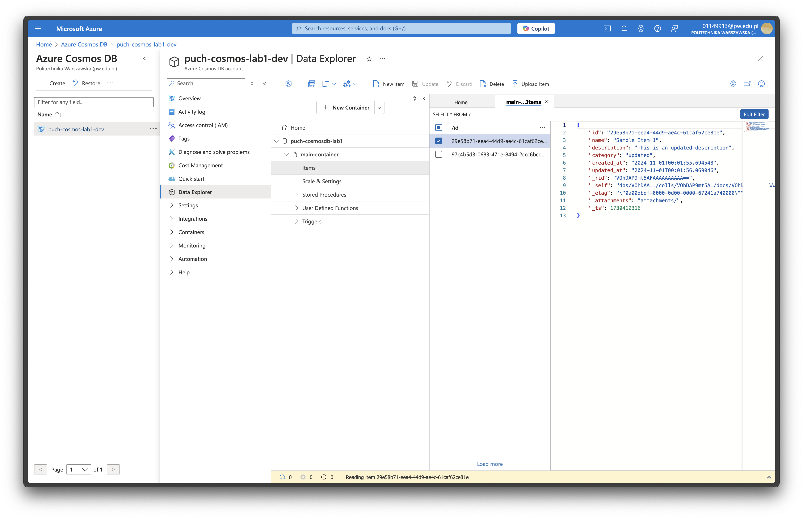
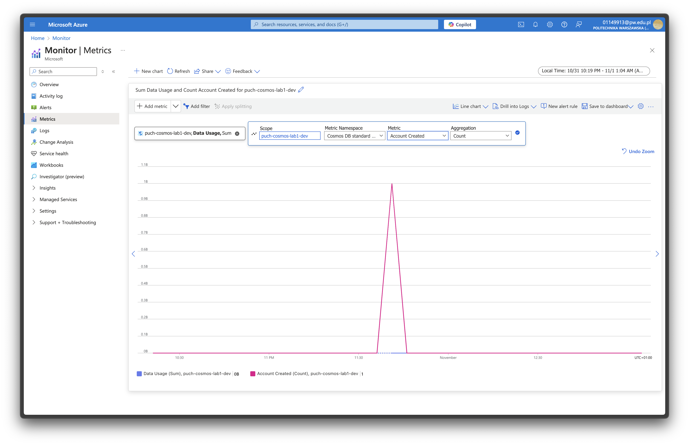

# Ćwiczenie: Baza danych MS SQL Server w Azure

Mając doświadczenie w pracy z Azure wiedziałem, że nie chcę korzystać z panelu web do realizacji zadań.
Zdecydowałem się zatem na skorzystanie z narzędzi CLI. Całość kodu napisanego do realizacji zadań dostępna jest do
wglądu na [repozytorium GitHub](https://github.com/mycielski/puch/tree/main/lab_1).

## Utworzenie konta w Azure

Konto w Azure utworzyłem już kilka semestrów temu także po prostu się do niego zalogowałem (w panelu oraz używając
narzędzia CLI `az`). Nie było w nim żadnych zasobów.



## Utworzenie instancji Azure SQL Database

Utworzyłem bazę danych. Użyłem bardzo skromnych rozmiarów sprzętu aby uniknąć niepotrzebnych kosztów.
Z tego samego powodu darowałem sobie replikację i backup.

## Połączenie z bazą danych

Zadanie realizowałem na swoim komputerze Macbook, zatem nie miałem dostępu do SSMS.
Aby móc wykorzystać SSMS stworzyłem VM w Azure z tym programem. Poniższy zrzut ekranu przedstawia połączenie z tego VM
do mojej bazy.
VM została zabezpieczona przy użyciu reguły pozwalającej na przychodzący ruch sieciowy wyłącznie z mojego publicznego
adresu IPv4.

Całe połączenie wyglądało zatem tak:


## Tworzenie aplikacji

Użyłem Microsoft Excel aby podłączyć się do bazy i zaimplementować wyświetlanie danych w interfejsie użytkownika.
Do **firewall**a bazy danych dodałem regułę pozwalającą na przychodzący ruch z mojego publicznego adresu IPv4.


## Praca z Azure Table Storage

Utworzyłem storage account, w nim tabelę, a w tabeli encję. Próbowałem napisać PowerQuery w Excelu aby połączyć się z
tabelą, ale niestety nie udało mi się tego zrobić.

### CRUD

Napisałem [program w Pythonie](clients/table.py), który dodaje, odczytuje, modyfikuje i usuwa encje z tabeli.

```text
$ python client/main.py 
Entity created successfully: employees/emp001
Entity found: {'PartitionKey': 'employees', 'RowKey': 'emp001', 'name': 'John Doe', 'email': 'john@example.com', 'department': 'IT'}
Entity updated successfully: employees/emp001

Listing all entities in partition 'employees':
{'PartitionKey': 'employees', 'RowKey': 'emp001', 'department': 'HR', 'email': 'john@example.com', 'name': 'John Doe', 'title': 'Manager'}
Entity deleted successfully: employees/emp001

Listing all entities in partition 'employees':

Process finished with exit code 0
```

## Azure Cosmos DB

Utworzyłem poniższą bazę danych:



### Aplikacja CRUD

Napisałem [program w Pythonie](clients/cosmos.py), który dodaje, odczytuje, modyfikuje i usuwa encje z bazy danych.

```text
$ python clients/cosmos.py 

=== Creating new items ===
Created item: 055a5d94-ca3c-425a-89ef-c370a8b36f29
Created item: 254803bd-d640-4b29-8c9b-84b38448b34c

=== Reading item ===
Retrieved item: {
  "id": "055a5d94-ca3c-425a-89ef-c370a8b36f29",
  "name": "Sample Item 1",
  "description": "This is a test item",
  "category": "test",
  "created_at": "2024-10-31T23:55:41.982168",
  "updated_at": "2024-10-31T23:55:41.982227",
  "_rid": "VOhDAP9mt5ABAAAAAAAAAA==",
  "_self": "dbs/VOhDAA==/colls/VOhDAP9mt5A=/docs/VOhDAP9mt5ABAAAAAAAAAA==/",
  "_etag": "\"0a00bad5-0000-0d00-0000-672418fe0000\"",
  "_attachments": "attachments/",
  "_ts": 1730418942
}

=== Updating item ===
Updated item: 055a5d94-ca3c-425a-89ef-c370a8b36f29
Updated item: {
  "id": "055a5d94-ca3c-425a-89ef-c370a8b36f29",
  "name": "Sample Item 1",
  "description": "This is an updated description",
  "category": "updated",
  "created_at": "2024-10-31T23:55:41.982168",
  "updated_at": "2024-10-31T23:55:42.404974",
  "_rid": "VOhDAP9mt5ABAAAAAAAAAA==",
  "_self": "dbs/VOhDAA==/colls/VOhDAP9mt5A=/docs/VOhDAP9mt5ABAAAAAAAAAA==/",
  "_etag": "\"0a00bcd5-0000-0d00-0000-672418fe0000\"",
  "_attachments": "attachments/",
  "_ts": 1730418942
}

=== Listing all items ===
Found 2 items:
- Sample Item 1 (055a5d94-ca3c-425a-89ef-c370a8b36f29)
- Sample Item 2 (254803bd-d640-4b29-8c9b-84b38448b34c)

=== Deleting items ===
Deleted item: 055a5d94-ca3c-425a-89ef-c370a8b36f29
Deleted item: 254803bd-d640-4b29-8c9b-84b38448b34c

Process finished with exit code 0
```

Aplikacja skutecznie wykonuje operacje CRUD.



### Azure Monitor

W Monitorze widoczne są różne dane o bazie. Poniżej screen ilustrujący utworzenie konta.


